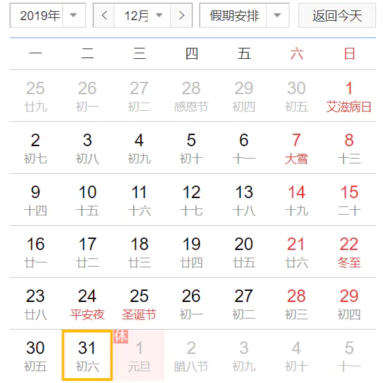
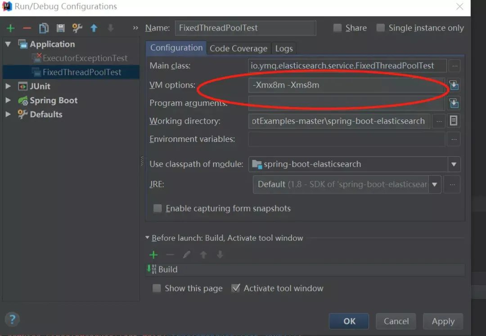
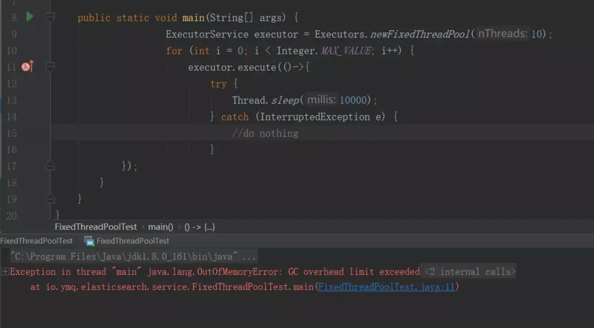
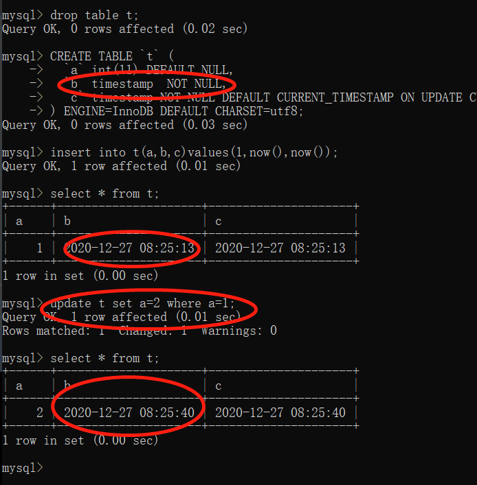

#### 1.1包装类型的空指针问题 

```java
public class NullPointTest {

    public static void main(String[] args) throws InterruptedException {
        System.out.println(testInteger(null));
    }

    private static Integer testInteger(Integer i) {
        return i + 1;  //包装类型，传参可能为null，直接计算，则会导致空指针问题
    }
}
```

#### 1.2 级联调用的空指针问题 

```java
public class NullPointTest {
    public static void main(String[] args) {
       //fruitService.getAppleService() 可能为空，会导致空指针问题
        fruitService.getAppleService().getWeight().equals("OK");
    }
}
```

#### 1.3 Equals方法左边的空指针问题 

```java
public class NullPointTest {
    public static void main(String[] args) {
        String s = null;
        if (s.equals("666")) { //s可能为空，会导致空指针问题
            System.out.println("公众号：捡田螺的小男孩，666");
        }
    }
}
```

#### 1.4 ConcurrentHashMap 这样的容器不支持 Key，Value 为 null。 

```java
public class NullPointTest {
    public static void main(String[] args) {
        Map map = new ConcurrentHashMap<>();
        String key = null;
        String value = null;
        map.put(key, value);
    }
}
```

#### 1.5 集合，数组直接获取元素 

```java
public class NullPointTest {
    public static void main(String[] args) {
        int [] array=null;
        List list = null;
        System.out.println(array[0]); //空指针异常
        System.out.println(list.get(0)); //空指针一场
    }
}
```

#### 1.6 对象直接获取属性 

```java
public class NullPointTest {
    public static void main(String[] args) {
        User user=null;
        System.out.println(user.getAge()); //空指针异常
    }
}
```

### 2. 日期YYYY格式设置的坑 

日常开发，经常需要对日期格式化，但是呢，年份设置为YYYY大写的时候，是有坑的哦。

反例：

```java
Calendar calendar = Calendar.getInstance();
calendar.set(2019, Calendar.DECEMBER, 31);

Date testDate = calendar.getTime();

SimpleDateFormat dtf = new SimpleDateFormat("YYYY-MM-dd");
System.out.println("2019-12-31 转 YYYY-MM-dd 格式后 " + dtf.format(testDate));
```

运行结果：

```java
2019-12-31 转 YYYY-MM-dd 格式后 2020-12-31
```

「解析：」

为什么明明是2019年12月31号，就转了一下格式，就变成了2020年12月31号了？因为YYYY是基于周来计算年的，它指向当天所在周属于的年份，一周从周日开始算起，周六结束，只要本周跨年，那么这一周就算下一年的了。正确姿势是使用yyyy格式。



正例：

```java
Calendar calendar = Calendar.getInstance();
calendar.set(2019, Calendar.DECEMBER, 31);

Date testDate = calendar.getTime();

SimpleDateFormat dtf = new SimpleDateFormat("yyyy-MM-dd");
System.out.println("2019-12-31 转 yyyy-MM-dd 格式后 " + dtf.format(testDate));
```

### 3.金额数值计算精度的坑 

看下这个浮点数计算的例子吧：

```java
public class DoubleTest {
    public static void main(String[] args) {
        System.out.println(0.1+0.2);
        System.out.println(1.0-0.8);
        System.out.println(4.015*100);
        System.out.println(123.3/100);

        double amount1 = 3.15;
        double amount2 = 2.10;
        if (amount1 - amount2 == 1.05){
            System.out.println("OK");
        }
    }
}
```

运行结果：

```java
0.30000000000000004
0.19999999999999996
401.49999999999994
1.2329999999999999
```

可以发现，结算结果跟我们预期不一致，其实是因为计算机是以二进制存储数值的，对于浮点数也是。对于计算机而言，0.1无法精确表达，这就是为什么浮点数会导致精确度缺失的。因此，「金额计算，一般都是用BigDecimal 类型」

对于以上例子，我们改为BigDecimal，再看看运行效果：

```java
System.out.println(new BigDecimal(0.1).add(new BigDecimal(0.2)));
System.out.println(new BigDecimal(1.0).subtract(new BigDecimal(0.8)));
System.out.println(new BigDecimal(4.015).multiply(new BigDecimal(100)));
System.out.println(new BigDecimal(123.3).divide(new BigDecimal(100)));
```

运行结果：

```java
0.3000000000000000166533453693773481063544750213623046875
0.1999999999999999555910790149937383830547332763671875
401.49999999999996802557689079549163579940795898437500
1.232999999999999971578290569595992565155029296875
```

发现结果还是不对，「其实」，使用 BigDecimal 表示和计算浮点数，必须使用「字符串的构造方法」来初始化 BigDecimal，正例如下：

```java
public class DoubleTest {
    public static void main(String[] args) {
        System.out.println(new BigDecimal("0.1").add(new BigDecimal("0.2")));
        System.out.println(new BigDecimal("1.0").subtract(new BigDecimal("0.8")));
        System.out.println(new BigDecimal("4.015").multiply(new BigDecimal("100")));
        System.out.println(new BigDecimal("123.3").divide(new BigDecimal("100")));
    }
}
```

在进行金额计算，使用BigDecimal的时候，我们还需要「注意BigDecimal的几位小数点，还有它的八种舍入模式哈」。

### 4. FileReader默认编码导致乱码问题 

看下这个例子：

```java
public class FileReaderTest {
    public static void main(String[] args) throws IOException {

        Files.deleteIfExists(Paths.get("jay.txt"));
        Files.write(Paths.get("jay.txt"), "你好,捡田螺的小男孩".getBytes(Charset.forName("GBK")));
        System.out.println("系统默认编码："+Charset.defaultCharset());

        char[] chars = new char[10];
        String content = "";
        try (FileReader fileReader = new FileReader("jay.txt")) {
            int count;
            while ((count = fileReader.read(chars)) != -1) {
                content += new String(chars, 0, count);
            }
        }
        System.out.println(content);
    }
}
```

运行结果：

```java
系统默认编码：UTF-8
���,�����ݵ�С�к�
```

从运行结果，可以知道，系统默认编码是utf8，demo中读取出来，出现乱码了。为什么呢？

> ❝
>
> FileReader 是以当「前机器的默认字符集」来读取文件的，如果希望指定字符集的话，需要直接使用 InputStreamReader 和 FileInputStream。
>
> ❞

正例如下：

```java
public class FileReaderTest {
    public static void main(String[] args) throws IOException {

        Files.deleteIfExists(Paths.get("jay.txt"));
        Files.write(Paths.get("jay.txt"), "你好,捡田螺的小男孩".getBytes(Charset.forName("GBK")));
        System.out.println("系统默认编码："+Charset.defaultCharset());

        char[] chars = new char[10];
        String content = "";
        try (FileInputStream fileInputStream = new FileInputStream("jay.txt");
             InputStreamReader inputStreamReader = new InputStreamReader(fileInputStream, Charset.forName("GBK"))) {
            int count;
            while ((count = inputStreamReader.read(chars)) != -1) {
                content += new String(chars, 0, count);
            }
        }
        System.out.println(content);
    }
}
```

### 5. Integer缓存的坑 

```java
public class IntegerTest {

    public static void main(String[] args) {
        Integer a = 127;
        Integer b = 127;
        System.out.println("a==b:"+ (a == b));
        
        Integer c = 128;
        Integer d = 128;
        System.out.println("c==d:"+ (c == d));
    }
}
```

运行结果：

```java
a==b:true
c==d:false
```

为什么Integer值如果是128就不相等了呢？「编译器会把 Integer a = 127 转换为 Integer.valueOf(127)。」 我们看下源码。

```java
public static Integer valueOf(int i) {
      if (i >= IntegerCache.low && i <= IntegerCache.high)
          return IntegerCache.cache[i + (-IntegerCache.low)];
      return new Integer(i);
 }
```

可以发现，i在一定范围内，是会返回缓存的。

> ❝
>
> 默认情况下呢，这个缓存区间就是\[-128, 127\]，所以我们业务日常开发中，如果涉及Integer值的比较，需要注意这个坑哈。还有呢，设置 JVM 参数加上 -XX:AutoBoxCacheMax=1000，是可以调整这个区间参数的，大家可以自己试一下哈
>
> ❞

### 6. static静态变量依赖spring实例化变量，可能导致初始化出错 

之前看到过类似的代码。静态变量依赖于spring容器的bean。

```java
 private static SmsService smsService = SpringContextUtils.getBean(SmsService.class);
```

这个静态的smsService有可能获取不到的，因为类加载顺序不是确定的，正确的写法可以这样，如下：

```java
 private static SmsService  smsService =null;
 
 //使用到的时候采取获取
 public static SmsService getSmsService(){
   if(smsService==null){
      smsService = SpringContextUtils.getBean(SmsService.class);
   }
   return smsService;
 }
```

### 7. 使用ThreadLocal，线程重用导致信息错乱的坑 

使用ThreadLocal缓存信息，有可能出现信息错乱的情况。看下下面这个例子吧。

```java
private static final ThreadLocal<Integer> currentUser = ThreadLocal.withInitial(() -> null);

@GetMapping("wrong")
public Map wrong(@RequestParam("userId") Integer userId) {
    //设置用户信息之前先查询一次ThreadLocal中的用户信息
    String before  = Thread.currentThread().getName() + ":" + currentUser.get();
    //设置用户信息到ThreadLocal
    currentUser.set(userId);
    //设置用户信息之后再查询一次ThreadLocal中的用户信息
    String after  = Thread.currentThread().getName() + ":" + currentUser.get();
    //汇总输出两次查询结果
    Map result = new HashMap();
    result.put("before", before);
    result.put("after", after);
    return result;
}
```

按理说，每次获取的before应该都是null，但是呢，程序运行在 Tomcat 中，执行程序的线程是 Tomcat 的工作线程，而 Tomcat 的工作线程是基于线程池的。

> ❝
>
> 线程池会重用固定的几个线程，一旦线程重用，那么很可能首次从 ThreadLocal 获取的值是之前其他用户的请求遗留的值。这时，ThreadLocal 中的用户信息就是其他用户的信息。
>
> ❞

把tomcat的工作线程设置为1

```java
server.tomcat.max-threads=1
```

用户1，请求过来，会有以下结果，符合预期：


用户2请求过来，会有以下结果，「不符合预期」：


因此，使用类似 ThreadLocal 工具来存放一些数据时，需要特别注意在代码运行完后，显式地去清空设置的数据，正例如下：

```java
@GetMapping("right")
public Map right(@RequestParam("userId") Integer userId) {
    String before  = Thread.currentThread().getName() + ":" + currentUser.get();
    currentUser.set(userId);
    try {
        String after = Thread.currentThread().getName() + ":" + currentUser.get();
        Map result = new HashMap();
        result.put("before", before);
        result.put("after", after);
        return result;
    } finally {
        //在finally代码块中删除ThreadLocal中的数据，确保数据不串
        currentUser.remove();
    }
}
```

### 8. 疏忽switch的return和break 

这一点严格来说，应该不算坑，但是呢，大家写代码的时候，有些朋友容易疏忽了。直接看例子吧

```java
/*
 * 关注公众号：
 * 捡田螺的小男孩
 */
public class SwitchTest {

    public static void main(String[] args) throws InterruptedException {
        System.out.println("testSwitch结果是："+testSwitch("1"));
    }

    private static String testSwitch(String key) {
        switch (key) {
            case "1":
                System.out.println("1");
            case "2":
                System.out.println(2);
                return "2";
            case "3":
                System.out.println("3");
            default:
                System.out.println("返回默认值");
                return "4";
        }
    }
}
```

输出结果：

```java
测试switch
1
2
testSwitch结果是：2
```

switch 是会「沿着case一直往下匹配的，知道遇到return或者break。」 所以，在写代码的时候留意一下，是不是你要的结果。

### 9. Arrays.asList的几个坑 

#### 9.1 基本类型不能作为 Arrays.asList方法的参数，否则会被当做一个参数。 

```java
public class ArrayAsListTest {
    public static void main(String[] args) {
        int[] array = {1, 2, 3};
        List list = Arrays.asList(array);
        System.out.println(list.size());
    }
}
```

运行结果：

```java
1
```

Arrays.asList源码如下：

```java
public static <T> List<T> asList(T... a) {
    return new ArrayList<>(a);
}
```

#### 9.2 Arrays.asList 返回的 List 不支持增删操作。 

```java
public class ArrayAsListTest {
    public static void main(String[] args) {
        String[] array = {"1", "2", "3"};
        List list = Arrays.asList(array);
        list.add("5");
        System.out.println(list.size());
    }
}
```

运行结果：

```java
Exception in thread "main" java.lang.UnsupportedOperationException
 at java.util.AbstractList.add(AbstractList.java:148)
 at java.util.AbstractList.add(AbstractList.java:108)
 at object.ArrayAsListTest.main(ArrayAsListTest.java:11)
```

Arrays.asList 返回的 List 并不是我们期望的 java.util.ArrayList，而是 Arrays 的内部类 ArrayList。内部类的ArrayList没有实现add方法，而是父类的add方法的实现，是会抛出异常的呢。

#### 9.3 使用Arrays.asLis的时候，对原始数组的修改会影响到我们获得的那个List 

```java
public class ArrayAsListTest {
    public static void main(String[] args) {
        String[] arr = {"1", "2", "3"};
        List list = Arrays.asList(arr);
        arr[1] = "4";
        System.out.println("原始数组"+Arrays.toString(arr));
        System.out.println("list数组" + list);
    }
}
```

运行结果：

```java
原始数组[1, 4, 3]
list数组[1, 4, 3]
```

从运行结果可以看到，原数组改变，Arrays.asList转化来的list也跟着改变啦，大家使用的时候要注意一下哦，可以用new ArrayList(Arrays.asList(arr))包一下的。

#### 10. ArrayList.toArray() 强转的坑 

```java
public class ArrayListTest {
    public static void main(String[] args) {
        List<String> list = new ArrayList<String>(1);
        list.add("公众号：捡田螺的小男孩");
        String[] array21 = (String[])list.toArray();//类型转换异常
    }
}
```

因为返回的是Object类型，Object类型数组强转String数组，会发生ClassCastException。解决方案是，使用toArray()重载方法toArray(T\[\] a)

```java
String[] array1 = list.toArray(new String[0]);//可以正常运行
```

### 11. 异常使用的几个坑 

#### 11.1 不要弄丢了你的堆栈异常信息 

```java
public void wrong1(){
    try {
        readFile();
    } catch (IOException e) {
        //没有把异常e取出来，原始异常信息丢失  
        throw new RuntimeException("系统忙请稍后再试");
    }
}

public void wrong2(){
    try {
        readFile();
    } catch (IOException e) {
        //只保留了异常消息，栈没有记录啦
        log.error("文件读取错误, {}", e.getMessage());
        throw new RuntimeException("系统忙请稍后再试");
    }
}
```

正确的打印方式，应该酱紫

```java
public void right(){
    try {
        readFile();
    } catch (IOException e) {
        //把整个IO异常都记录下来，而不是只打印消息
        log.error("文件读取错误", e);
        throw new RuntimeException("系统忙请稍后再试");
    }
}
```

#### 11.2 不要把异常定义为静态变量 

```java
public void testStaticExeceptionOne{
    try {
        exceptionOne();
    } catch (Exception ex) {
        log.error("exception one error", ex);
    }
    try {
        exceptionTwo();
    } catch (Exception ex) {
        log.error("exception two error", ex);
    }
}

private void exceptionOne() {
    //这里有问题
    throw Exceptions.ONEORTWO;
}

private void exceptionTwo() {
    //这里有问题
    throw Exceptions.ONEORTWO;
}
```

exceptionTwo抛出的异常，很可能是 exceptionOne的异常哦。正确使用方法，应该是new 一个出来。

```java
private void exceptionTwo() {
    throw new BusinessException("业务异常", 0001);
}
```

#### 11.3 生产环境不要使用e.printStackTrace(); 

```java
public void wrong(){
    try {
        readFile();
    } catch (IOException e) {
       //生产环境别用它
        e.printStackTrace();
    }
}
```

因为它占用太多内存，造成锁死，并且，日志交错混合，也不易读。正确使用如下：

```java
log.error("异常日志正常打印方式",e);
```

#### 11.4 线程池提交过程中，出现异常怎么办？ 

```java
public class ThreadExceptionTest {

    public static void main(String[] args) {
        ExecutorService executorService = Executors.newFixedThreadPool(10);

        IntStream.rangeClosed(1, 10).forEach(i -> executorService.submit(()-> {
                    if (i == 5) {
                        System.out.println("发生异常啦");
                        throw new RuntimeException("error");
                    }
                    System.out.println("当前执行第几:" + Thread.currentThread().getName() );
                }
        ));
        executorService.shutdown();
    }
}
```

运行结果：

```java
当前执行第几:pool-1-thread-1
当前执行第几:pool-1-thread-2
当前执行第几:pool-1-thread-3
当前执行第几:pool-1-thread-4
发生异常啦
当前执行第几:pool-1-thread-6
当前执行第几:pool-1-thread-7
当前执行第几:pool-1-thread-8
当前执行第几:pool-1-thread-9
当前执行第几:pool-1-thread-10
```

可以发现，如果是使用submit方法提交到线程池的异步任务，异常会被吞掉的，所以在日常发现中，如果会有可预见的异常，可以采取这几种方案处理：

 *  1.在任务代码try/catch捕获异常
 *  2.通过Future对象的get方法接收抛出的异常，再处理
 *  3.为工作者线程设置UncaughtExceptionHandler，在uncaughtException方法中处理异常
 *  4.重写ThreadPoolExecutor的afterExecute方法，处理传递的异常引用

#### 11.5 finally重新抛出的异常也要注意啦 

```java
public void wrong() {
    try {
        log.info("try");
        //异常丢失
        throw new RuntimeException("try");
    } finally {
        log.info("finally");
        throw new RuntimeException("finally");
    }
}
```

一个方法是不会出现两个异常的呢，所以finally的异常会把try的「异常覆盖」。正确的使用方式应该是，finally 代码块「负责自己的异常捕获和处理」。

```java
public void right() {
    try {
        log.info("try");
        throw new RuntimeException("try");
    } finally {
        log.info("finally");
        try {
            throw new RuntimeException("finally");
        } catch (Exception ex) {
            log.error("finally", ex);
        }
    }
}
```

### 12.JSON序列化,Long类型被转成Integer类型！ 

```java
public class JSONTest {
    public static void main(String[] args) {

        Long idValue = 3000L;
        Map<String, Object> data = new HashMap<>(2);
        data.put("id", idValue);
        data.put("name", "捡田螺的小男孩");

        Assert.assertEquals(idValue, (Long) data.get("id"));
        String jsonString = JSON.toJSONString(data);

        // 反序列化时Long被转为了Integer
        Map map = JSON.parseObject(jsonString, Map.class);
        Object idObj = map.get("id");
        System.out.println("反序列化的类型是否为Integer："+(idObj instanceof Integer));
        Assert.assertEquals(idValue, (Long) idObj);
    }
}
```

「运行结果：」

```java
Exception in thread "main" 反序列化的类型是否为Integer：true
java.lang.ClassCastException: java.lang.Integer cannot be cast to java.lang.Long
 at object.JSONTest.main(JSONTest.java:24)
```

> ❝
>
> 「注意啦」，序列化为Json串后，Josn串是没有Long类型呢。而且反序列化回来如果也是Object接收，数字小于Interger最大值的话，给转成Integer啦！
>
> ❞

### 13. 使用Executors声明线程池，newFixedThreadPool的OOM问题 

```java
ExecutorService executor = Executors.newFixedThreadPool(10);
        for (int i = 0; i < Integer.MAX_VALUE; i++) {
            executor.execute(() -> {
                try {
                    Thread.sleep(10000);
                } catch (InterruptedException e) {
                    //do nothing
                }
            });
        }
```

「IDE指定JVM参数：-Xmx8m -Xms8m :」



运行结果：  




我们看下源码，其实newFixedThreadPool使用的是无界队列！  


```java
public static ExecutorService newFixedThreadPool(int nThreads) {
    return new ThreadPoolExecutor(nThreads, nThreads,
                                  0L, TimeUnit.MILLISECONDS,
                                  new LinkedBlockingQueue<Runnable>());
}

public class LinkedBlockingQueue<E> extends AbstractQueue<E>
        implements BlockingQueue<E>, java.io.Serializable {
    ...


    /**
     * Creates a {@code LinkedBlockingQueue} with a capacity of
     * {@link Integer#MAX_VALUE}.
     */
    public LinkedBlockingQueue() {
        this(Integer.MAX_VALUE);
    }
...
}
```

> ❝
>
> newFixedThreadPool线程池的核心线程数是固定的，它使用了近乎于无界的LinkedBlockingQueue阻塞队列。当核心线程用完后，任务会入队到阻塞队列，如果任务执行的时间比较长，没有释放，会导致越来越多的任务堆积到阻塞队列，最后导致机器的内存使用不停的飙升，造成JVM OOM。
>
> ❞

### 14. 直接大文件或者一次性从数据库读取太多数据到内存，可能导致OOM问题 

如果一次性把大文件或者数据库太多数据达到内存，是会导致OOM的。所以，为什么查询DB数据库，一般都建议分批。

读取文件的话，一般问文件不会太大，才使用`Files.readAllLines()`。为什么呢？因为它是直接把文件都读到内存的，预估下不会OOM才使用这个吧，可以看下它的源码：

```java
public static List<String> readAllLines(Path path, Charset cs) throws IOException {
    try (BufferedReader reader = newBufferedReader(path, cs)) {
        List<String> result = new ArrayList<>();
        for (;;) {
            String line = reader.readLine();
            if (line == null)
                break;
            result.add(line);
        }
        return result;
    }
}
```

如果是太大的文件，可以使用Files.line()按需读取，当时读取文件这些，一般是使用完需要「关闭资源流」的哈

### 15. 先查询，再更新/删除的并发一致性问题 

再日常开发中，这种代码实现经常可见：先查询是否有剩余可用的票，再去更新票余量。

```java
if(selectIsAvailable(ticketId){ 
    1、deleteTicketById(ticketId) 
    2、给现金增加操作 
}else{ 
    return “没有可用现金券” 
}
```

如果是并发执行，很可能有问题的，应该利用数据库的更新/删除的原子性，正解如下：

```java
if(deleteAvailableTicketById(ticketId) == 1){ 
    1、给现金增加操作 
}else{ 
    return “没有可用现金券” 
}
```

### 16. 数据库使用utf-8存储， 插入表情异常的坑 

低版本的MySQL支持的utf8编码，最大字符长度为 3 字节，但是呢，存储表情需要4个字节，因此如果用utf8存储表情的话，会报`SQLException: Incorrect string value: '\xF0\x9F\x98\x84' for column`，所以一般用utf8mb4编码去存储表情。

### 17. 事务未生效的坑 

日常业务开发中，我们经常跟事务打交道，「事务失效」主要有以下几个场景：

 *  底层数据库引擎不支持事务
 *  在非public修饰的方法使用
 *  rollbackFor属性设置错误
 *  本类方法直接调用
 *  异常被try...catch吃了，导致事务失效。

其中，最容易踩的坑就是后面两个，「注解的事务方法给本类方法直接调用」，伪代码如下：

```java
public class TransactionTest{
  public void A(){
    //插入一条数据
    //调用方法B (本地的类调用，事务失效了)
    B();
  }
  
  @Transactional
  public void B(){
    //插入数据
  }
}
```

如果异常被catch住，「那事务也是会失效呢」~，伪代码如下：

```java
@Transactional
public void method(){
  try{
    //插入一条数据
    insertA();
    //更改一条数据
    updateB();
  }catch(Exception e){
    logger.error("异常被捕获了，那你的事务就失效咯",e);
  }
}
```

### 18. 当反射遇到方法重载的坑 

```java
/**
 *  反射demo
 *  @author 捡田螺的小男孩
 */
public class ReflectionTest {

    private void score(int score) {
        System.out.println("int grade =" + score);
    }

    private void score(Integer score) {
        System.out.println("Integer grade =" + score);
    }

    public static void main(String[] args) throws Exception {
        ReflectionTest reflectionTest = new ReflectionTest();
        reflectionTest.score(100);
        reflectionTest.score(Integer.valueOf(100));

        reflectionTest.getClass().getDeclaredMethod("score", Integer.TYPE).invoke(reflectionTest, Integer.valueOf("60"));
        reflectionTest.getClass().getDeclaredMethod("score", Integer.class).invoke(reflectionTest, Integer.valueOf("60"));
    }
}
```

运行结果：

```java
int grade =100
Integer grade =100
int grade =60
Integer grade =60
```

如果「不通过反射」，传入`Integer.valueOf(100)`，走的是Integer重载。但是呢，反射不是根据入参类型确定方法重载的，而是「以反射获取方法时传入的方法名称和参数类型来确定」的

```java
getClass().getDeclaredMethod("score", Integer.class)
getClass().getDeclaredMethod("score", Integer.TYPE)
```

### 19. mysql 时间 timestamp的坑 

有更新语句的时候，timestamp可能会自动更新为当前时间，看个demo

```java
CREATE TABLE `t` (
  `a` int(11) DEFAULT NULL,
  `b` timestamp  NOT NULL,
  `c` timestamp NOT NULL DEFAULT CURRENT_TIMESTAMP ON UPDATE CURRENT_TIMESTAMP
) ENGINE=InnoDB DEFAULT CHARSET=utf8
```

我们可以发现 「c列」 是有`CURRENT_TIMESTAMP ON UPDATE CURRENT_TIMESTAMP`，所以c列会随着记录更新而「更新为当前时间」。但是b列也会随着有记录更新为而「更新为当前时间」。



可以使用datetime代替它,需要更新为当前时间，就把`now()`赋值进来，或者修改mysql的这个参数`explicit_defaults_for_timestamp`。

### 20. mysql8数据库的时区坑 

之前我们对mysql数据库进行升级，新版本为8.0.12。但是升级完之后，发现now()函数，获取到的时间比北京时间晚8小时，原来是因为mysql8默认为美国那边的时间，需要指定下时区

```java
jdbc:mysql://localhost:3306/test?useUnicode=true&characterEncoding=UTF-8&
serverTimezone=Asia/Shanghai
```

  