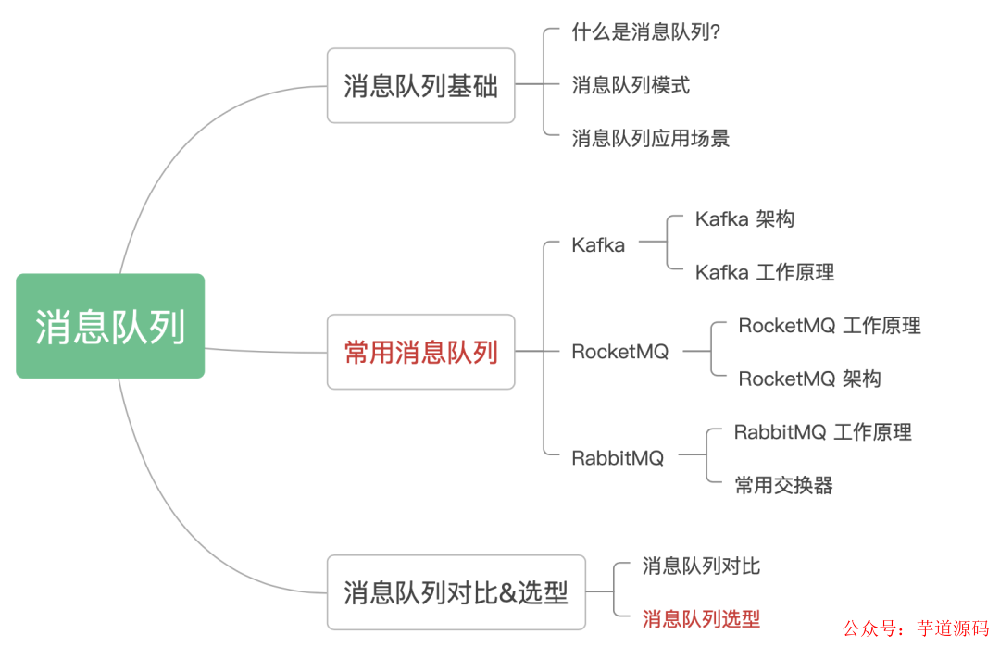
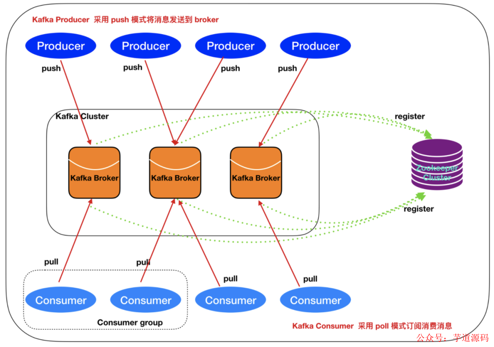
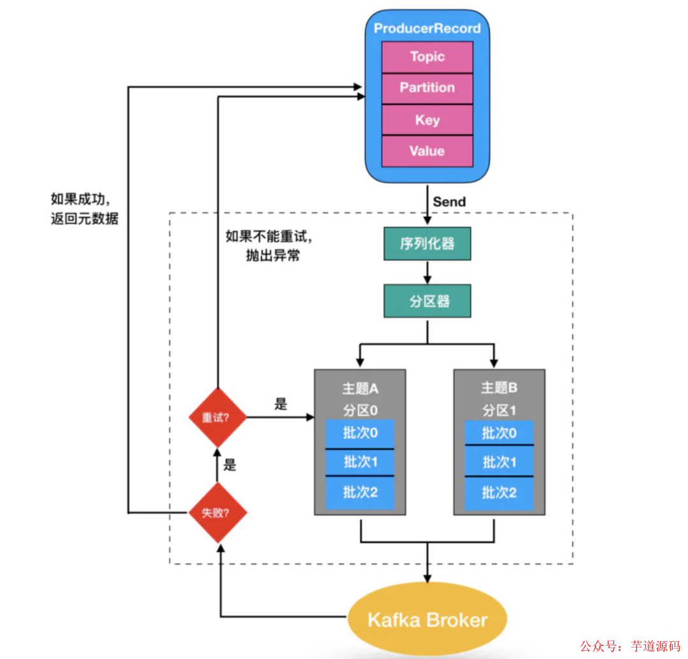
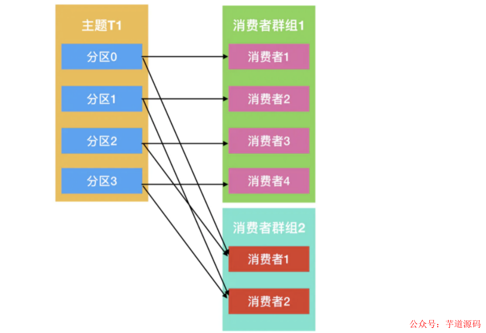
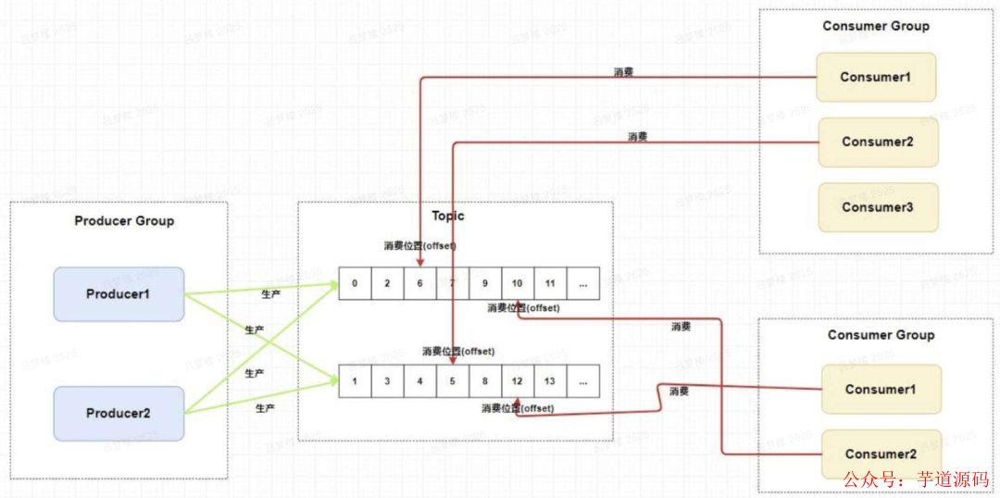
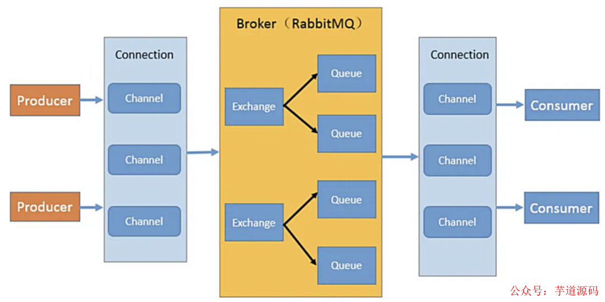
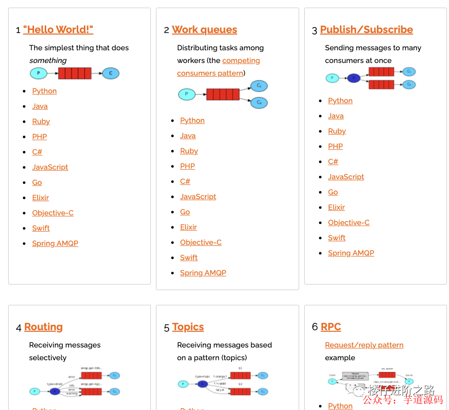

消息队列中间件重要吗？面试必问问题之一，你说重不重要。我有时会问同事，为啥你用 RabbitMQ，不用 Kafka，或者 RocketMQ 呢，他给我的回答 “因为公司用的就是这个，大家都这么用”，如果你去面试，直接就被 Pass，今天这篇文章，告诉你如何回答。

这篇文章，我重点突出消息队列选型，弱化每种队列内部的实现细节，精华提炼，可读性更强！

常用的消息队列主要这 4 种，分别为 Kafka、RabbitMQ、RocketMQ 和 ActiveMQ，主要介绍前三，不BB，上思维导图！

## 消息队列基础

### 什么是消息队列？

消息队列是在消息的传输过程中保存消息的容器，用于接收消息并以文件的方式存储，一个消息队列可以被一个也可以被多个消费者消费，包含以下 3 元素：

 *  Producer：消息生产者，负责产生和发送消息到 Broker；
 *  Broker：消息处理中心，负责消息存储、确认、重试等，一般其中会包含多个 Queue；
 *  Consumer：消息消费者，负责从 Broker 中获取消息，并进行相应处理。

### 消息队列模式

 *  点对点模式：多个生产者可以向同一个消息队列发送消息，一个具体的消息只能由一个消费者消费。

 *  发布/订阅模式：单个消息可以被多个订阅者并发的获取和处理。

### 消息队列应用场景

 *  应用解耦 ：消息队列减少了服务之间的耦合性，不同的服务可以通过消息队列进行通信，而不用关心彼此的实现细节。
 *  异步处理 ：消息队列本身是异步的，它允许接收者在消息发送很长时间后再取回消息。
 *  流量削锋 ：当上下游系统处理能力存在差距的时候，利用消息队列做一个通用的”载体”，在下游有能力处理的时候，再进行分发与处理。
 *  日志处理 ：日志处理是指将消息队列用在日志处理中，比如 Kafka 的应用，解决大量日志传输的问题。
 *  消息通讯 ：消息队列一般都内置了高效的通信机制，因此也可以用在纯的消息通讯，比如实现点对点消息队列，或者聊天室等。
 *  消息广播 ：如果没有消息队列，每当一个新的业务方接入，我们都要接入一次新接口。有了消息队列，我们只需要关心消息是否送达了队列，至于谁希望订阅，是下游的事情，无疑极大地减少了开发和联调的工作量。

## 常用消息队列

由于官方社区现在对 ActiveMQ 5.x 维护越来越少，较少在大规模吞吐的场景中使用，所以我们主要讲解 Kafka、RabbitMQ 和 RocketMQ。

### Kafka
Apache Kafka 最初由 LinkedIn 公司基于独特的设计实现为一个分布式的提交日志系统，之后成为 Apache 项目的一部分，号称大数据的杀手锏，在数据采集、传输、存储的过程中发挥着举足轻重的作用。

它是一个分布式的，支持多分区、多副本，基于 Zookeeper 的分布式消息流平台 ，它同时也是一款开源的基于发布订阅模式的消息引擎系统。

#### 重要概念

 *  主题（Topic） ：消息的种类称为主题，可以说一个主题代表了一类消息，相当于是对消息进行分类，主题就像是数据库中的表。
 *  分区（partition） ：主题可以被分为若干个分区，同一个主题中的分区可以不在一个机器上，有可能会部署在多个机器上，由此来实现 kafka 的伸缩性。
 *  批次 ：为了提高效率， 消息会分批次写入 Kafka，批次就代指的是一组消息。
 *  消费者群组（Consumer Group） ：消费者群组指的就是由一个或多个消费者组成的群体。
 *  Broker : 一个独立的 Kafka 服务器就被称为 broker，broker 接收来自生产者的消息，为消息设置偏移量，并提交消息到磁盘保存。
 *  Broker 集群 ：broker 集群由一个或多个 broker 组成。
 *  重平衡（Rebalance） ：消费者组内某个消费者实例挂掉后，其他消费者实例自动重新分配订阅主题分区的过程。

#### Kafka 架构

一个典型的 Kafka 集群中包含 Producer、broker、Consumer Group、Zookeeper 集群。

Kafka 通过 Zookeeper 管理集群配置，选举 leader，以及在 Consumer Group 发生变化时进行 rebalance。Producer 使用 push 模式将消息发布到 broker，Consumer 使用 pull 模式从 broker 订阅并消费消息。

#### Kafka 工作原理

消息经过序列化后，通过不同的分区策略，找到对应的分区。

相同主题和分区的消息，会被存放在同一个批次里 ，然后由一个独立的线程负责把它们发到 Kafka Broker 上。

分区的策略包括顺序轮询、随机轮询和 key hash 这 3 种方式，那什么是分区呢？

分区是 Kafka 读写数据的最小粒度，比如主题 A 有 15 条消息，有 5 个分区，如果采用顺序轮询的方式，15 条消息会顺序分配给这 5 个分区，后续消费的时候，也是按照分区粒度消费。

由于分区可以部署在多个不同的机器上，所以可以通过分区实现 Kafka 的伸缩性，比如主题 A 的 5 个分区，分别部署在 5 台机器上，如果下线一台，分区就变为 4。

Kafka 消费是通过消费群组完成，同一个消费者群组，一个消费者可以消费多个分区，但是一个分区，只能被一个消费者消费。

如果消费者增加，会触发 Rebalance，也就是分区和消费者需要重新配对 。

不同的消费群组互不干涉 ，比如下图的 2 个消费群组，可以分别消费这 4 个分区的消息，互不影响。

### RocketMQ 

RocketMQ 是阿里开源的消息中间件，它是纯 Java 开发，具有高性能、高可靠、高实时、适合大规模分布式系统应用的特点。

RocketMQ 思路起源于 Kafka，但并不是 Kafka 的一个 Copy，它对消息的可靠传输及事务性做了优化 ，目前在阿里集团被广泛应用于交易、充值、流计算、消息推送、日志流式处理、binlog 分发等场景。

#### 重要概念 

 *  Name 服务器（NameServer） ：充当注册中心，类似 Kafka 中的 Zookeeper。
 *  Broker : 一个独立的 RocketMQ 服务器就被称为 broker，broker 接收来自生产者的消息，为消息设置偏移量。
 *  主题（Topic） ：消息的第一级类型，一条消息必须有一个 Topic。
 *  子主题（Tag） ：消息的第二级类型，同一业务模块不同目的的消息就可以用相同 Topic 和不同的 Tag 来标识。
 *  分组（Group） ：一个组可以订阅多个 Topic，包括生产者组（Producer Group）和消费者组（Consumer Group）。
 *  队列（Queue） ：可以类比 Kafka 的分区 Partition。

#### RocketMQ 工作原理 

RockerMQ 中的消息模型就是按照主题模型所实现的，包括 Producer Group、Topic、Consumer Group 三个角色。

为了提高并发能力，一个 Topic 包含多个 Queue ，生产者组根据主题将消息放入对应的 Topic，下图是采用轮询的方式找到里面的 Queue。

RockerMQ 中的消费群组和 Queue，可以类比 Kafka 中的消费群组和 Partition：不同的消费者组互不干扰，一个 Queue 只能被一个消费者消费，一个消费者可以消费多个 Queue。

消费 Queue 的过程中，通过偏移量记录消费的位置。

#### RocketMQ 架构 

RocketMQ 技术架构中有四大角色 NameServer、Broker、Producer 和 Consumer，下面主要介绍 Broker。

Broker 用于存放 Queue，一个 Broker 可以配置多个 Topic，一个 Topic 中存在多个 Queue。

如果某个 Topic 消息量很大，应该给它多配置几个 Queue，并且尽量多分布在不同 broker 上，以减轻某个 broker 的压力。Topic 消息量都比较均匀的情况下，如果某个 broker 上的队列越多，则该 broker 压力越大。

简单提一下，Broker 通过集群部署，并且提供了 master/slave 的结构，slave 定时从 master 同步数据（同步刷盘或者异步刷盘），如果 master 宕机，则 slave 提供消费服务，但是不能写入消息。

看到这里，大家应该可以发现，RocketMQ 的设计和 Kafka 真的很像！

### RabbitMQ 

RabbitMQ 2007 年发布，是使用 Erlang 语言开发的开源消息队列系统，基于 AMQP 协议来实现。

AMQP 的主要特征是面向消息、队列、路由、可靠性、安全。AMQP 协议更多用在企业系统内，对数据一致性、稳定性和可靠性要求很高的场景，对性能和吞吐量的要求还在其次。

#### 重要概念 

 *  信道（Channel） ：消息读写等操作在信道中进行，客户端可以建立多个信道，每个信道代表一个会话任务。
 *  交换器（Exchange） ：接收消息，按照路由规则将消息路由到一个或者多个队列；如果路由不到，或者返回给生产者，或者直接丢弃。
 *  路由键（RoutingKey） ：生产者将消息发送给交换器的时候，会发送一个 RoutingKey，用来指定路由规则，这样交换器就知道把消息发送到哪个队列。
 *  绑定（Binding） ：交换器和消息队列之间的虚拟连接，绑定中可以包含一个或者多个 RoutingKey。

#### RabbitMQ 工作原理 

AMQP 协议模型由三部分组成：生产者、消费者和服务端，执行流程如下：

1.  生产者是连接到 Server，建立一个连接，开启一个信道。
2.  生产者声明交换器和队列，设置相关属性，并通过路由键将交换器和队列进行绑定。
3.  消费者也需要进行建立连接，开启信道等操作，便于接收消息。
4.  生产者发送消息，发送到服务端中的虚拟主机。
5.  虚拟主机中的交换器根据路由键选择路由规则，发送到不同的消息队列中。
6.  订阅了消息队列的消费者就可以获取到消息，进行消费。

#### 常用交换器 

RabbitMQ 常用的交换器类型有 direct、topic、fanout、headers 四种。

具体的使用方法，可以参考官网：

 *  官网入口：https://www.rabbitmq.com/getstarted.html

## 消息队列对比&选型 

### 消息队列对比 

#### Kafka 

优点：

 *  高吞吐、低延迟 ：Kafka 最大的特点就是收发消息非常快，Kafka 每秒可以处理几十万条消息，它的最低延迟只有几毫秒；
 *  高伸缩性 ：每个主题（topic）包含多个分区（partition），主题中的分区可以分布在不同的主机（broker）中；
 *  高稳定性 ：Kafka 是分布式的，一个数据多个副本，某个节点宕机，Kafka 集群能够正常工作；
 *  持久性、可靠性、可回溯 ：Kafka 能够允许数据的持久化存储，消息被持久化到磁盘，并支持数据备份防止数据丢失，支持消息回溯；
 *  消息有序：通过控制能够保证所有消息被消费且仅被消费一次；
 *  有优秀的第三方 Kafka Web 管理界面 Kafka-Manager，在日志领域比较成熟，被多家公司和多个开源项目使用。

缺点：

 *  Kafka 单机超过 64 个队列/分区，Load 会发生明显的飙高现象，队列越多，load 越高，发送消息响应时间变长；
 *  不支持消息路由，不支持延迟发送，不支持消息重试；
 *  社区更新较慢。

#### RocketMQ 

优点：

 *  高吞吐 ：借鉴 Kafka 的设计，单一队列百万消息的堆积能力；
 *  高伸缩性 ：灵活的分布式横向扩展部署架构，整体架构其实和 kafka 很像；
 *  高容错性 ：通过ACK机制，保证消息一定能正常消费；
 *  持久化、可回溯 ：消息可以持久化到磁盘中，支持消息回溯；
 *  消息有序：在一个队列中可靠的先进先出（FIFO）和严格的顺序传递；
 *  支持发布/订阅和点对点消息模型，支持拉、推两种消息模式；
 *  提供 docker 镜像用于隔离测试和云集群部署，提供配置、指标和监控等功能丰富的 Dashboard。

缺点：

 *  不支持消息路由， 支持的客户端语言不多，目前是 java 及 c++，其中 c++ 不成熟 ；
 *  部分支持消息有序：需要将同一类的消息 hash 到同一个队列 Queue 中，才能支持消息的顺序，如果同一类消息散落到不同的 Queue中，就不能支持消息的顺序。
 *  社区活跃度一般。

#### RabbitMQ 

优点：

 *  支持几乎所有最受欢迎的编程语言 ：Java，C，C ++，C＃，Ruby，Perl，Python，PHP等等；
 *  支持消息路由 ：RabbitMQ 可以通过不同的交换器支持不同种类的消息路由；
 *  消息时序 ：通过延时队列，可以指定消息的延时时间，过期时间TTL等；
 *  支持容错处理：通过交付重试和死信交换器（DLX）来处理消息处理故障；
 *  提供了一个易用的用户界面，使得用户可以监控和管理消息 Broker；
 *  社区活跃度高。

缺点：

 *  Erlang 开发，很难去看懂源码，不利于做二次开发和维护 ，基本只能依赖于开源社区的快速维护和修复 bug；
 *  RabbitMQ 吞吐量会低一些 ，这是因为他做的实现机制比较重；
 *  不支持消息有序、持久化不好、不支持消息回溯、伸缩性一般。

### 消息队列选型 

 *  Kafka：追求高吞吐量，一开始的目的就是用于日志收集和传输， 适合产生大量数据的互联网服务的数据收集业务 ，大型公司建议可以选用， 如果有日志采集功能，肯定是首选 kafka。
 *  RocketMQ： 天生为金融互联网领域而生，对于可靠性要求很高的场景 ，尤其是电商里面的订单扣款，以及业务削峰，在大量交易涌入时，后端可能无法及时处理的情况。RocketMQ 在稳定性上可能更值得信赖，这些业务场景在阿里双 11 已经经历了多次考验， 如果你的业务有上述并发场景，建议可以选择 RocketMQ。
 *  RabbitMQ：结合 erlang 语言本身的并发优势，性能较好，社区活跃度也比较高，但是不利于做二次开发和维护，不过 RabbitMQ 的社区十分活跃，可以解决开发过程中遇到的 bug。 如果你的数据量没有那么大，小公司优先选择功能比较完备的 RabbitMQ。
 *  ActiveMQ：官方社区现在对 ActiveMQ 5.x 维护越来越少， 较少在大规模吞吐的场景中使用。